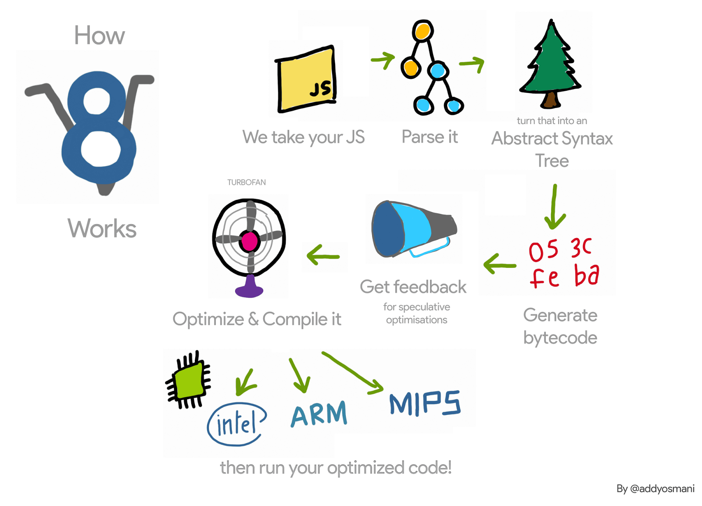
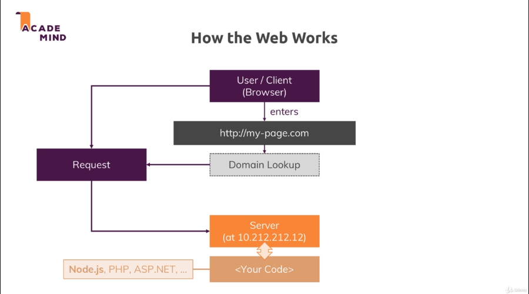
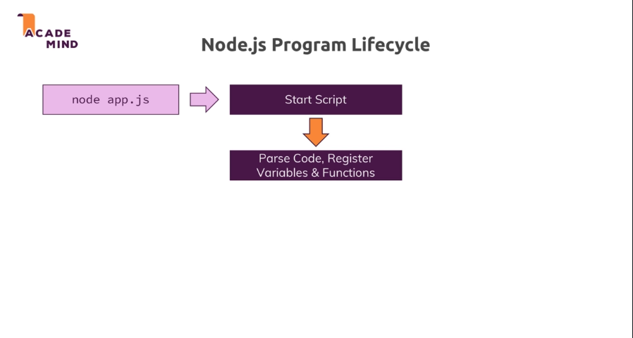
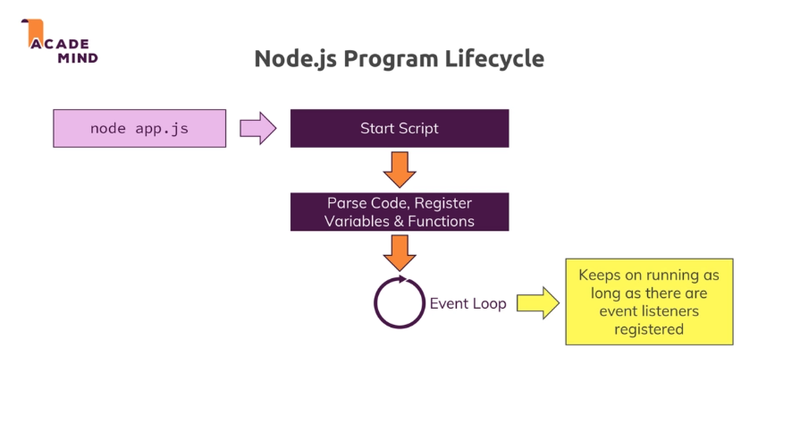

# Node.js

Aqui estão reunidas todas as minhas anotações relacionadas ao desenvolvimento utilizando Node.js, adaptei as anotações para que atendesse a leitura de outras pessoas, oferecendo outra perspectiva de vários assuntos relacionados ao Node.js.

<!-- - [Node.js](#nodejs) -->
  - [Funcionamento e Utilização](#funcionamento-e-utiliza%C3%A7%C3%A3o)
  - [O que é a V8 Engine?](#o-que-%C3%A9-a-v8-engine)
    - [Por quê o Node usa a V8?](#por-qu%C3%AA-o-node-usa-a-v8)
    - [A V8 modificada pelo Node.js](#a-v8-modificada-pelo-nodejs)
    - [Mas por quê ainda se utiliza o browser quando se cria aplicações utilizando o Node.js?](#mas-por-qu%C3%AA-ainda-se-utiliza-o-browser-quando-se-cria-aplica%C3%A7%C3%B5es-utilizando-o-nodejs)
  - [Principais Utilizações](#principais-utiliza%C3%A7%C3%B5es)
  - [As Responsabilidades do Node.js](#as-responsabilidades-do-nodejs)
    - [Onde fica o código implementado?](#onde-fica-o-c%C3%B3digo-implementado)
    - [Requisições e Respostas - Protocolo HTTP / HTTPS](#requisi%C3%A7%C3%B5es-e-respostas---protocolo-http--https)
- [Node.js Lifecycle (Ciclo de vida)](#nodejs-lifecycle-ciclo-de-vida)

## Funcionamento e Utilização

Sabe-se que o Javascript é uma linguagem que roda em browsers, ou seja, sempre que a página em que o script roda é carregada, todo o código Javascript é executado. O Nodejs basicamente pega o Javascript e transporta para outro ambiente, o sistema operacional (Servidores em sua maioria rodam em sistemas operacionais, mesmo que em cloud).

**Isso basicamente te permite não só executar o Javascript em um browser, mas em qualquer ambiente de sistema operacional.** Seu código JavaScript irá rodar fora dos browsers.

Vale lembrar também que o Node.js não possui estrutura visual, em vez disso ele tem funcionalidades necessárias em servidores, como por exemplo, HTTP library ou filesystem API (Sem a utilização do Node, manipulação de arquivos por exemplo, não seria possível sem o módulo `fs`).

Como tal, o ambiente omite APIs JavaScript específicas do navegador e adiciona suporte para APIs de sistema operacional mais tradicionais, incluindo bibliotecas de sistemas HTTP e File System.

## O que é a V8 Engine?

V8 é basicamente a engine por trás do Google Chrome que decifra seu código Javascript e traduz em código de máquina, para que o código seja processado, atualmente é utilizada no navegador Chrome.

Quando se utiliza o Google Chrome, e ele detecta o Javascript em uma página, por muitas vezes entre as tags `` o código passará pela V8 engine que irá processar o código Javascript, para que o resultado desse código seja retornado o Chrome, seja mostrar algo no console, ou execução de mídia em páginas web.

### Por quê o Node usa a V8?

A engine V8 é open source construída em C++ para compilar Javascript no Google Chrome, assim o criador do Node Ryan Dahl, modificou o código fonte da engine para que ela rodasse também fora dos navegadores em sistemas operacionais como Linux e Windows.

O mais importante aqui é saber que você não executa seus projetos Node.js em um browser, em vez disso são executados no computador que estiver usando. Não há relação entre a engine V8 e os browsers Firefox, Safari, etc. Cada browser tem seus próprios interpretadores. 

**Porém é comum abrirmos nosso servidor Node.js em browsers, deve-se saber que todo o processo de envio do que está sendo mostrado no browser é feito no servidor, Node.js rodando JavaScript e enviando respostas ao navegador, tudo no sistema operacional.**

### A V8 modificada pelo Node.js

O desenvolvimento do Node.js modificou a V8 engine para que pudesse atender funcionalidades que são necessárias em servidores, como ler arquivos, enviar respostas HTTP. Tal funcionalidades que não são suportadas pelos browsers.

### Mas por quê ainda se utiliza o browser quando se cria aplicações utilizando o Node.js?

Como dito anteriormente, o Nodejs possibilita a execução do Javascript no servidor \(em algum sistema operacional\) então quando acessamos um link como esse [http://localhost:8000/](http://localhost:8000/), ao criar aplicações Node, estamos acessando um servidor que está em execução mandando como resposta o que está sendo mostrado no browser, através de um navegador.

## Principais Utilizações

Existem três principais "roles" onde o Node.js pode atuar no desenvolvimento web, são elas:

* **Executar o servidor**

Diferente do PHP, que precisaria de módulos externos para ouvir requisições, o Node.js faz tanto o "listening" de requisições, como roda o servidor (enviando respostas) ao mesmo tempo, basicamente executa o servidor e escuta as requisições, e então ao capturar os "listenings" envia a resposta programada pelo desenvolvedor \(se houver\).

* **Lógica de Negócio**

Pode ser utilizado nesta camada (podemos dizer assim) para manipular requisições (Handle Requests), validar 'inputs' e se conectar á um banco de dados, é basicamente a parte de manipulação das requisições.

* **Responses**

Retornar Responses (rendered HTTP, JSON,...)

É Importante ressaltar que o Node.js nos permite executar Javascript em sistemas operacionais, ou seja,  fora do browser e assim através da linguagem podemos construir e rodar o servidor com métodos POST, GET e etc.

Diversas vezes quando se cria servidores em Node.js se utiliza de módulos que oferecem códigos pré-escritos que aprimoram a experiência de desenvolvimento. Basicamente deixa as implementações mais fáceis inclusive a criação de API's, um exemplo é o Express.js que abstrai bastante complexidade do que faríamos com Node.js puro, deixando o código mais consistente e limpo, além de outras funcionalidades e integrações, isso permite que ao desenvolver uma aplicação, o foco principal será o desenvolvimento da lógica de negócio da aplicação, sem perder tempo reinventando a roda.

## As Responsabilidades do Node.js

### Onde fica o código implementado?

A imagem acima ilustra bem onde vamos implementar códigos escritos em Javascript, ao requisitar uma URL no nosso browser, o navegador manda uma requisição ao servidor do seu provedor de internet em busca do endereço IP do site requisitado \(através do domínio\) então o que é retornado pelo servidor ao navegador pode ser escrito em Node.js. Essa resposta pode conter um arquivo HTML por exemplo, além disso ela também tem "headers" que são informações sobre o que contém dentro do que está sendo retornado ao navegador.

Há inúmeras possibilidades para implementação de código ao lado do servidor, algumas delas são:

* Validação de dados
* Acesso a um banco de dados

### Requisições e Respostas - Protocolo HTTP / HTTPS

Como visto na imagem o browser requisita ao servidor por exemplo a nossa página HTML e o nosso código Node.js manda de volta essa página através do servidor, para acontecer esses envios e respostas existem algumas regras que devemos seguir, regras essas estipuladas pelos protocolos HTTP / HTTPS, os principais protocolos para transmissão de dados entre cliente \(browser\) e servidor.

O protocolo HTTP significa Hyper Text Transfer Protocol, o que controla as regras de transferências entre o browser e o servidor, sua diferença quanto ao HTTPS \(Hyper Text Transfer Protocol Secure\) é que o HTTPS encripta os dados durante a transmissão entre cliente e servidor.

# Node.js Lifecycle (Ciclo de vida)

Meu professor disse que quando estava aprendendo Node.js vinha de um grande background de PHP, no qual basicamente só se escrevia a resposta no qual iria ser enviada ao browser, quando ele viu que utilizar o Node significada escrever também o próprio servidor, teve uma grande dificuldade de entendimento, então com essa experiência ele conseguiu explicar de maneira simples, começando pelo ciclo de vida de um servirdor node.js.

Ao criarmos o servidor utilizando o módulo http, podemos observar que ele fica rodando em background, vamos entender o que acontece:

Sabemos que quando executamos o nosso código, iniciamos o script, então todo o código é compilado pela V8, porém algo importante acontece aqui, um importande conceito do Node.js, chamado Event Loop:

É um processo de loop constante gerenciado pelo próprio Node.js que continua rodando enquanto houver listeners (escutadores) de eventos no código, então a partir do momento em que criamos o servidor, o processo de loop já começa. Esse processo pode ser interrompido com o código `process.exit();` e existem outros comandos disponíveis para controlar o event loop.
